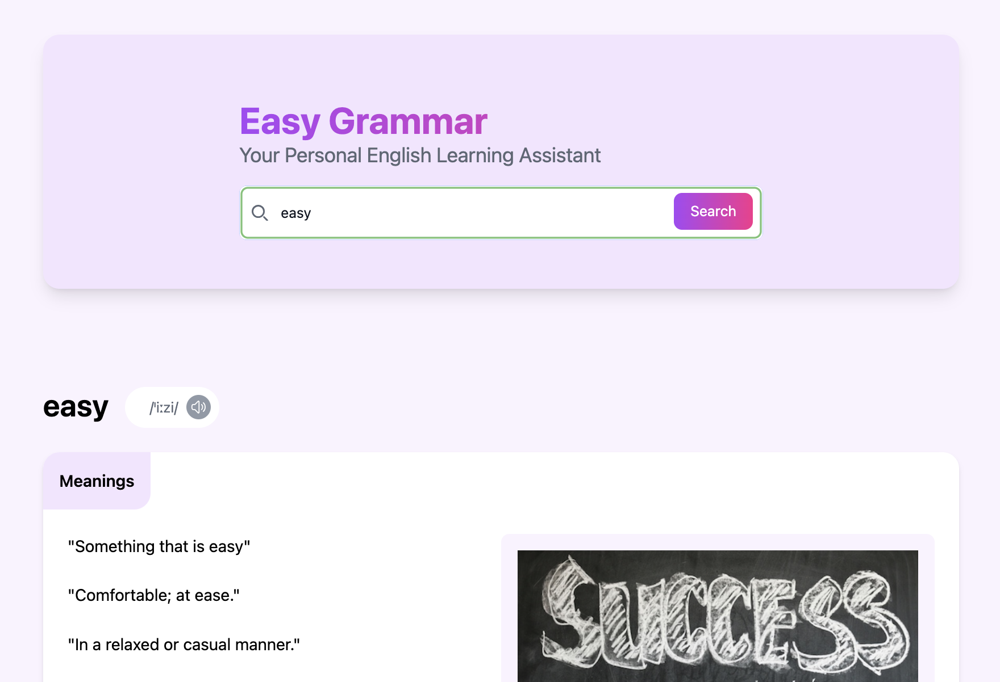
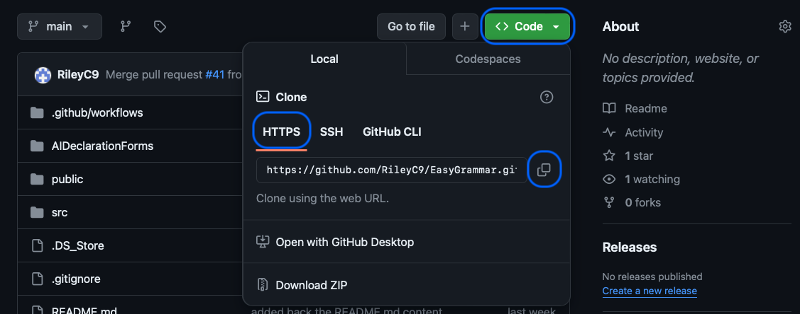

# EasyGrammar

## 📖 Overview:

Our project aims to develop an application that will assist users in improving their English language skills. This project is developed using **React**, **Free Dictionary API** and **OpenAI API**.

<!--  The README should also include a link to the public URL, project demo, reports, presentations and any other relevant information. -->

[**Visit the Website**](https://easygrammar.netlify.app/) | [**Project Demo Video**](https://drive.google.com/file/d/1BGwYyWy6-Ay4LPMKNaLGZ9Xeqsm9he0E/view?usp=drive_link) | [**Project Report**]()

---



---

## 🎯 Project Objectives:

Our objective is to create a website having the ability to help people who want to **improve their English vocabularies**. People can always check the dictionary and learn new words. However, learning a language, or vocabularies, is all about practice.
<br><br>Therefore, we create this AI powered English vocabulary website, allowing our users to search a vocabulary. The website will display the definitions, sample sentances, and pronounciation from Free Dictionary API to our users.
<br><br>Moreover, we will use the word being searched to create an image from OpenAI API. We believe this will help the user to remember the vocabulary through visualization. Beside, users can practice their English writing by describing the image. Their description will be sent to OpenAI API for grammar analysis. In this way, the users can receive customised feedbacks based on the grammar mistakes they made, and our objective will be achieved.

## 🚀 Project Features:

- **Provide definitions**: Users can search a vocabulary and get the definition.
- **Sample sentence retrieval**: Users can learn sample sentence.
- **Pronunciation**: Users can listen to the pronunciation of the word.
- **Image generation and display**: Users can see an image generated from the sample sentances.
- **Check for grammar and sentence correctness**: Users’ description will be sent to OpenAI API for grammar analysis.
- **Feedback and scoring mechanisms**: Users will receive customised feedbacks based on the grammar mistakes they made.

## 👥 Project Contributors:

- TingHin Cheung, Riley [RileyC9](https://github.com/RileyC9)
- Xavier Pardanaud [Xav92](https://github.com/Xav92)
- Yujie Peng [Yujie](https://github.com/Peng-Yujie)
- Ravinesh Sami [rsami00](https://github.com/rsami00)

## ⚛️ Tech stack:

- HTML, CSS
- JavaScript ES6 / React
- Free Dictionary API
- OpenAI API
- TailwindCSS
- Netlify

## 💬 AI Declaration forms

| Name             | Milestone #1                                                                            | Milestone #2                                                                        |
| ---------------- | --------------------------------------------------------------------------------------- | ----------------------------------------------------------------------------------- |
| TingHin Cheung   | [AI Declaration 1](./AIDeclarationForms/p1_AI_declaration_TingHin_Cheung_100396747.pdf) |                                                                                     |
| Yujie Peng       | [AI Declaration 1](./AIDeclarationForms/p1_AI_Declaration_Yujie_Peng_100407970.pdf)     | [AI Declaration 2](./AIDeclarationForms/p2_AI_Declaration_Yujie_Peng_100407970.pdf) |
| Ravinesh Sami    | [AI Declaration 1](./AIDeclarationForms/p1_AI_Declaration_Ravinesh_Sami_100399749.pdf)  |                                                                                     |
| Xavier Pardanaud | [AI Declaration 1](AIDeclarationForms/P1_AI_Declaration_Xavier_Pardanaud_100309633.pdf) |                                                                                     |
|                  |                                                                                         |                                                                                     |

## 💻 How to start our React website locally

All modern browsers should be able to support react website, expect Internet Exploere 11 or before (polyfills needed).

### 0. Before you start

- If you have not install [Node.js](https://nodejs.org/en/) on your machine. You can visit [freeCodeCamp](https://www.freecodecamp.org/news/how-to-install-react-a-step-by-step-guide/) and follow Step 1.
- You may need to install [npm](https://www.npmjs.com/get-npm) to install all the dependencies.
- You may need to install [Git](https://github.com/git-guides/install-git) to clone this repo to your local machine.
- Use your own [OpenAI API key](https://platform.openai.com/docs/overview) to run the project locally.
- Open your **Terminal**(macOS) or **Command Prompt**(Windows) to run the following commands.

### 1. Clone the repository to your local machine



```bash
git clone https://github.com/RileyC9/EasyGrammar.git
```

> Learn more about [git clone](https://github.com/git-guides/git-clone)

### 2. Move to the project directory

```bash
cd EasyGrammar
```

### 3. Install dependencies

Install all the necessary dependencies to run the application.

```bash
npm install
```

### 4. Start the application

Create a `.env` file in the root directory of the project and add the following line:

```bash
# replace YOUR_OPENAI_API_KEY with your own OpenAI API key
REACT_APP_OPENAI_API_KEY = "YOUR_OPENAI_API_KEY";
```

Then, run the following command to start the application:

```bash
npm start
```

Open [http://localhost:3000](http://localhost:3000) to view it in your browser.

> The page will reload when you make changes.\
> You may also see any lint errors in the console.

## ⚙️ How to run the tests

During the testing, we used [**Jest**](https://jestjs.io/docs/getting-started) as the testing framework. You can visit the documentation to learn more about how to run the tests.

Before running the tests, you need to install Jest on your machine:

```bash
npm install -g jest
```

To run the tests, you can use the following command:

```bash
npm test
```

You can edit the test file `App.test.js` in the `src` folder to add more tests.

## 📚 Learn More

This project was bootstrapped with [**Create React App**](https://github.com/facebook/create-react-app).

The above commands should have the application running. But if you encounter some other problems with [**npm**](https://docs.npmjs.com), you can visit the documentation to troubleshoot.

## 📝 References

- [Free Dictionary API](https://dictionaryapi.dev/)
- [OpenAI API](https://platform.openai.com/docs/overview)
- [React Documentation](https://reactjs.org/docs/getting-started.html)
- [Tailwind CSS Documentation](https://tailwindcss.com/docs)
- [Jest Documentation](https://jestjs.io/docs/getting-started)
- [Netlify Documentation](https://docs.netlify.com/)
